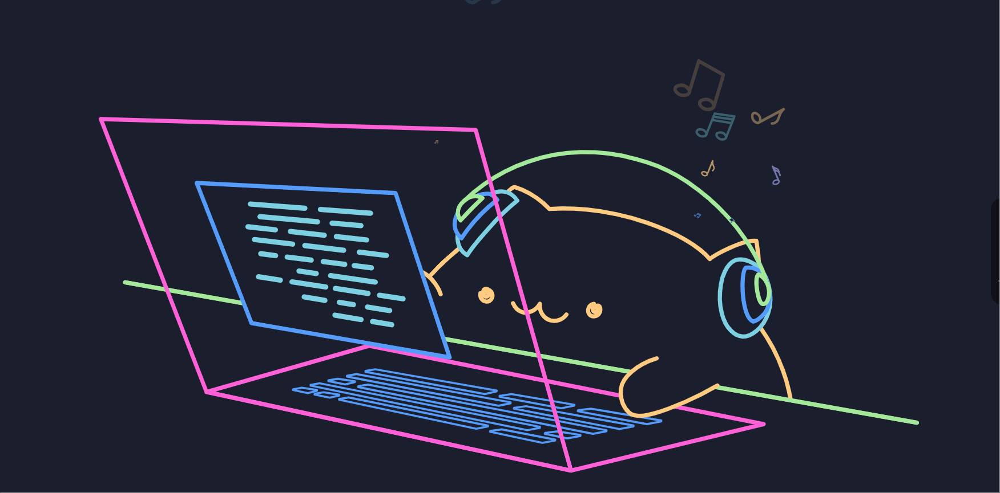

    

    
    
    

    

    
    

 

# JavaScript Lover 💻❤️

🙋‍♂️ Thank you for visiting my GitHub profile! 

## 🚀💻 Technologies & Tools

### <u> Languages: </u>

 

&nbsp;

&nbsp;

&nbsp;

&nbsp;

&nbsp;

### <u> Frontend Development Technologies and Tools: </u>

 

&nbsp;

&nbsp;

&nbsp;

&nbsp;

&nbsp;

&nbsp;

&nbsp;

### <u> Backend Development + Database + DevOps + Deployment Technologies & Tools: </u>

 

&nbsp;

&nbsp;

&nbsp;

&nbsp;

&nbsp;

&nbsp;

&nbsp;

&nbsp;

&nbsp;

&nbsp;

&nbsp;

### <u> Mobile App Development Technologies & Tools: </u>

 

&nbsp;

&nbsp;

### <u> Version Control and Tools:</u>

 

&nbsp;

&nbsp;

### <u> Operating Systems and Others:</u>

 

&nbsp;

&nbsp;

&nbsp;

&nbsp;

&nbsp;

 
 

<i> Recently, I'm also learning: </i>

&nbsp;

 

## Contact me 📱

 

  
  

 

 

-----
Credits: [Sebastian Castillo](https://github.com/UrgedAsp)

Last Edited on: 27/05/2024
